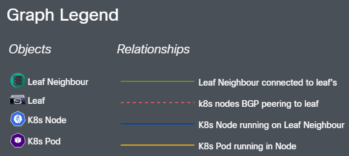

# Visualising Kubernetes ACI

[](https://github.com/datacenter/ACI-Kubernetes-Visualiser/actions/workflows/vkaci-test.yml) [](https://lgtm.com/projects/g/datacenter/ACI-Kubernetes-Visualiser/context:javascript) [](https://lgtm.com/projects/g/datacenter/ACI-Kubernetes-Visualiser/context:python)

## CISCO VKACI

## Introduction

Visualisation of Kubernetes using ACI (Vkaci) is an open-source tool that generates a cluster topology and provides a visual representation, using neo4j graph database by accessing ACI and K8s APIs. This tool lets you quickly build visualisations of K8s and ACI end to end topologies. The objective of this documentation is to outline the creation, design, and installation of Vkaci to help users view their topologies.

Cisco Application Centric Infrastructure (Cisco ACI) is a component of Cisco's purpose-based networking design, which enables data centre agility and resiliency. It creates a policy that captures higher-level business and user intent and turns it into the network constructs needed to dynamically supply network, security, and infrastructure services [1].

The Kubernetes API allows you to query and manipulate the state of Kubernetes API objects (For example: Pods, Namespaces, ConfigMaps, and Events).

## Product Value

- Graph visualisation helps in delivering data in the most efficient way possible.
- Vkaci is an essential tool as it collects raw data from the K8's API and APIC, models it and delivers it so the data is easier to understand and interpret.
- It has multiple views allowing users to see how their K8s Leafs, nodes and Pods are linked and interact with their Fabrics.
- Users can also see the connectivity of applications in pods so they're able to understand how changes to their infrastructure will affect their clusters.
- Scalability is promising with significantly large clusters supported. Tested currently with up to 200 nodes and 2500 pods.
- It's an easy tool available to let non-programmers create visualizations of network topologies.
- Free and open source to help showcase the possibilities of ACI and K8s.

## Dev Team


## Systems Design

### User Stories

| **#** | **Title** | **User Story** |
| --- | --- | --- |
| 1. | Cluster Graph Visualisation | As a network engineer, I want to visualise how my K8s cluster connects with ACI so I can confirm and view my network configuration. |
| 2. | Leaf Graph Visualisation | As a user, I want to visualise how a specific ACI Leaf connects within my K8s cluster so I can identify the Nodes connected to an ACI Leaf. |
| 3. | Node Graph Visualisation | Being a User, I want to visualise how a specific Node connects within the network so I can identify the network topology related to a Node. |
| 4. | Pod Graph Visualisation | As a User, I want to visualise how a specific Pod connects within the network so I can identify the network topology related to a Pod. |
| 5. | Table View | As a User, I want to see the details including, BGP Peering and Routes, of my ACI connected K8s cluster in a table so I can confirm the network configuration. |

### Product Architecture

The visualisation of the cluster network is based on two main views. One is an interactive graph network view, and the other is a detailed tree table view.

#### Topology View

The main visualisation of Vkaci represents different views of the cluster network using an interconnecting graph diagram.

A complete topology update with a 200 node cluster  takes roughly 1 min from refresh to display:

- 30 secs to load the pods in memory
- 25 secs to query ACI
- 10 secs to load from neo4j into the browser.

| **View** | **Description** |
| --- | --- |
| **Cluster** | This view shows the complete cluster along with filtered views of the pods, nodes and leafs. |
| **Leaf** | This view will show all the eBGP peers and hosts (Physical K8s Nodes or Hypervisors) connected to the selected leaf. |
| **Node** | This view will show the node where the pod resides and how the node is connected to the fabric. |
| **Pod** | This view will show the PODs, Hypervisor and eBGP peers the node interacts with. |

<br>

Graph Diagram Legend



Cluster Network Graph Example: Without Pods


Cluster Network Graph Example: Without specific Namespace


#### Table View

The secondary view of Vkaci outlines the cluster network in different tree table configurations.

| **View** | **Description** |
| --- | --- |
| **Complete View** | Shows the complete cluster network table with Leafs, VM Hosts, K8s Nodes and K8s Pods. The object name, namespace, IP and interface information is shown. |
| **BGB Peering** | Shows the BGP Peering information for cluster network. Displays the BGP peering between Leafs and K8s Nodes. This view also shows the routes for each Leaf. |
| **Leafs &amp; Nodes** | Shows the connection information of Nodes to Leafs either directly or through a VM Host. |
| **Leafs &amp; Pods** | Shows the connection information of Pods to Leafs. This view highlights how each application is connected to the fabric. |

<br>

Table View Example with Leafs and Nodes


#### Architecture Design

The below flowcharts are created to visualise the overall sequence and the logic behind this tool. The initial chart in figure 4, explains the connectivity and architecture of this tool. The second chart in figure 5, outlines the topology update process.

<br>

Vkaci Connectivity Overview


Vkaci topology update process


#### Libraries Used

VKACI is a web application using Python 3.9 and Flask as its server technology. To enable graph-based representation, Neo4j is used to save the transformed network topology.

#### Python Libraries

| **Library** | **Description** | **Used for** |
| --- | --- | --- |
| **Flask** | Flask is a WSGI web application framework that is lightweight. Flask enables extensions that make it simple to add new functionality. | Web server backend |
| **py2neo** | Py2neo is a client library and toolkit for interacting with Neo4j from Python applications and the command line. | Saving the network topology into Neo4j |
| **pyaci** | Python bindings for the Cisco Application Centric Infrastructure REST API are provided by PyACI [1]. | Extracting information from APIC |
| **kubernetes-client** | Python client library for the Kubernetes API. | Extracting information from K8s |
| **unittest** | The module included with Python for unit testing [4]. | Unit testing the Vkaci modules. |

#### JavaScript Libraries

| **Library** | **Description** | **Used for** |
| --- | --- | --- |
| **neovis.js** | A JavaScript library that enables quick visualisation of Neo4j graph data based on specific Cypher queries. | Graph visualisation of cluster topologies |
| **Webix** | JavaScript UI design system used for fast development of web interfaces. Contains a vast collection of web components and widgets. | Table View using a Webix Tree View |
| **jQuery** | jQuery makes tasks like HTML document traversal and manipulation, event handling, animation, and Ajax much easier with a user-friendly API. | To simplify some client-side functionality. |
| **Cisco UI** | A Cisco brand-sponsored lightweight presentation layer designed for web applications. | A consistent UI |

## Supported Configurations

### Supported Topologies

- K8s VMs running on Bare metal Hypervisors directly connected to ACI via single link, port-channel or vPC
- K8s Bare metal nodes directly connected to ACI via single link, port-channel or vPC (testing still in progress)

### Partially Supported Topologies

- Hypervisors in a blade server system. The topology will detect the Blade Switch as the directly connected node to ACI. No info on the K8s nodes to Hypervisor mapping. All the K8s nodes will be reported as running on the Blade Switch

### Untested Topology

- K8s Bare metal nodes running on blade servers. If you test let us know!
Note: VMM Integration is not required nor supported, physical domain for Floating SVI is used for both Bare Metal and VMs clusters

### Supported CNI Plugins

1. Calico - Calico is a networking and security solution for containers, virtual machines, and native host-based workloads that is open source. Calico includes a pure Linux eBPF data plane, a normal Linux networking data plane, and a Windows HNS data plane. Calico offers a complete networking stack, but it may also be used to enforce network policies in conjunction with cloud provider CNIs [6].

2. Kube-router - Kube-router is a project that provides a unified solution for CNI networking for pods, an IPVS-based network service proxy, and network policy enforcement using iptables. Kube-router includes a service proxy hence kube-proxy will not be installed in the cluster [5].

## Installing

### Connectivity Requirements in Cluster

Vkaci needs to connect to the APIC (OOB or InBand) via certificate-based authentication. It is expected that your APIC is pre-configured for certificate-based authentication.

### Installation – Helm Chart

A Helm chart for Vkaci has been created to enable simple deployment of the Vkaci app and a dependent Neo4j database along with required services on a K8s cluster.

The helm chart can currently be found in the source code for VKACI and is also available in the following repo:

<https://samiib.github.io/vkaci-chart>

**Required Variables:**

| **Name** | **Description** | **Example** |
| --- | --- | --- |
| apicIps | Comma separated list of your APIC Ips. | 10.67.185.102,10.67.185.41,10.67.185.42 |
| apicCertName | Name of the certificate configured in the APIC. | ansible.crt |
| apicKeyData | The base64 encoded string that represents the certificate data. | Steps to generate data below. |
| apicUsername | Name of the APIC certificate user. | ansible |
| vrfTenant | Tenant where the cluster VRF is deployed. | calico |
| vrfName | Name of the VRF used by the cluster. | vrf |
| n4jBrowserUrl | This will need to be set to an externally accessible URL. The browser needs to reach the Neo4j service directly to pull the topology data.| neo4j://192.168.2.1:30100 |
| n4jPassword | Neo4j user password. | use a strong password |

**Example values.yml:**

```yaml
# VKACI APIC Variables
apicIps: "10.67.185.102,10.67.185.41,10.67.185.42"
apicCertName: "ansible.crt"
apicKeyData: "<base64 certificate data>"
apicUsername: "ansible"
vrfTenant: "calico"
vrfName: "vrf"
# Neo4j Variables
n4jBrowserUrl: neo4j://192.168.2.1:30100
n4jPassword: "use a better password"
```

To generate the base64 data for apicKeyData from the apic key file use the base64 command. Eg.

```bash
base64 certificate.key
```

## Installation - Off Cluster/for development

Vkaci can also be run in a local mode outside of a K8s cluster. This mode is mostly used for development or debugging purposes. The variables from the helm chart correspond to the environment variables that the Vkaci Python scripts rely on. A separate Neo4j instance will also be required to run Vkaci locally.

Note that Vkaci may wipe the Neo4j database when it generates the network topology.

The following variables are required to be defined:

| **Name** | **Description** | **Example** |
| --- | --- | --- |
| **APIC_IPS** | Comma separated list of your APIC Ips. | 10.67.185.102,10.67.185.41,10.67.185.42 |
| **CERT_NAME** | Name of the certificate configured in the APIC. | ansible.crt |
| **KEY_PATH** | The location of the key used for APIC authentication. | /home/cisco/ansible.key |
| **CERT_USER** | Name of the APIC certificate user. | ansible |
| **TENANT** | Tenant where the cluster VRF is deployed. | calico |
| **VRF** | Name of the VRF used by the cluster. | vrf |
| **KUBE_CONFIG** | The location of your kubeconfig file. | /home/cisco/vkaci/calico.config |
| **NEO4J_URL** | The URL for the Vkaci server to access the Neo4j database. | neo4j://my-neo4j-release-neo4j:7687 |
| **NEO4J_BROWSER_URL** | This will need to be set to an externally accessible URL for the Vkaci browser to reach the Neo4j service. | neo4j://10.5.10.160:7687 |
| **NEO4J_USER** | The Neo4j user. | neo4j |
| **NEO4J_PASSWORD** | The password of the Neo4j user. | use a better password |

For example, to run Vkaci outside of a K8s cluster do the following:

```bash
export MODE=LOCAL APIC_IPS="10.67.185.102,10.67.185.42,10.67.185.41" CERT_NAME=ansible.crt CERT_USER=ansible TENANT=calico2 VRF=vrf KEY_PATH=/home/cisco/Coding/ansible.key KUBE_CONFIG=/home/cisco/Coding/vkaci/calico-2.config NEO4J_URL=neo4j://my-neo4j-release-neo4j:7687 NEO4J_BROWSER_URL=neo4j://my-neo4j-release-neo4j:7687 NEO4J_USER=neo4j NEO4J_PASSWORD="use a better password"
```

Execute the `init.py` script to locally load the ACI metadata used by pyaci. This is only required once.

Execute the `visibility_ui.py` script to run the Vkaci service in debug mode.

### Trouble Shooting Tips and Solutions

**The Vkaci pod is not starting:**

1. Check that all the variables are correctly set for your APIC and K8s cluster.
2. The Vkaci logging is quite comprehensive and should indicate what has occurred.
3. The init pod crashes: Ensure the vkaci Pod can talk directly with the APIC.

**The topology graphs are not appearing:**

1. The Neo4j browser URL setting needs to be accessible from the Vkaci browser client.
   1. This is mostly achieved by using a NodePort service to access port 7687 on the Neo4j pod
   2. Another option for quick temporary access is using kubectl to port-forward. This is only recommended for development or debugging.
2. Check the Topology Table and if it doesn't show any rows then check your variables and settings.

**The topology graphs are not showing leafs/hypervisors/bgp peering:**

This is most likely because your APIC is configured in a way that we have not encountered before.

## Limitations & Potential Improvements

### Limitations

- Vkaci is an open source, proof of concept tool hence has potential for further enhancements.
- There are some constraints to supporting all configurations at this stage.
- The intention of making this tool open source is to gain feedbacks or suggestions from the wider community in relation to any defects and unexpected anomalies that may appear. However, we tried our best to test it and implement enough logging and error handling so problems can be clearly identified.
- Scalability was a consideration hence Vkaci was tested and confirmed to work with a cluster consisting of 200 nodes and 2500 pods. Although, with larger topologies there can be a few seconds wait in loading time for a stabilized graph appearance. This is because of a fixed number of physics iterations prior to showing the result.
- The topology graphs use a visualisation library that uses physics simulations to attempt to positions graph objects evenly and dynamically. The topology graphs may appear differently each time. However, it is possible to reposition the graph objects manually to suit your preference.
- Blade systems are not supported and if a user is using blade system the "hypervisor" will in reality be the Blade System switch.

### Potential Improvements

- Add support for the Cilium CNI plugin
- Add support for clusters using NDFC
- Remove the Neo4j direct connection requirement by implementing a REST interface within the Vkaci service for graph data.

## References

[1] Cisco Systems, Inc., &quot;PyACI Documentation — PyACI 1.0 documentation,&quot; _pyaci.readthedocs.io_, 2015. [https://pyaci.readthedocs.io/en/latest/](https://pyaci.readthedocs.io/en/latest/) (accessed Feb. 02, 2022).

[2] The Kubernetes Authors, &quot;Cluster Networking,&quot; _Kubernetes_, 2022. [https://kubernetes.io/docs/concepts/cluster-administration/networking/](https://kubernetes.io/docs/concepts/cluster-administration/networking/) (accessed Mar. 2022).

[3] Cisco, &quot;Application Centric Infrastructure (ACI) - ACI Network,&quot; _Cisco_, 2022. [https://www.cisco.com/c/en/us/solutions/data-center-virtualization/application-centric-infrastructure/index.html#~features-and-benefits](https://www.cisco.com/c/en/us/solutions/data-center-virtualization/application-centric-infrastructure/index.html#~features-and-benefits) (accessed Apr. 05, 2022).

[4] The Python Software Foundation, &quot;unittest — Unit testing framework — Python 3.10.4 documentation,&quot; _docs.python.org_, 2022. [https://docs.python.org/3/library/unittest.html](https://docs.python.org/3/library/unittest.html) (accessed Feb. 2022).

[5] kOps - Kubernetes Operations, &quot;Kube-Router - kOps - Kubernetes Operations,&quot; _kops.sigs.k8s.io_, 2022. <https://kops.sigs.k8s.io/networking/kube-router/> (accessed May 20, 2022).

[6] Tigera, &quot;About Calico,&quot; _projectcalico.docs.tigera.io_, 2022. <https://projectcalico.docs.tigera.io/about/about-calico> (accessed Mar. 01, 2022).

© 2022 Cisco and/or its affiliates. All rights reserved. This document is Cisco Public Information.
